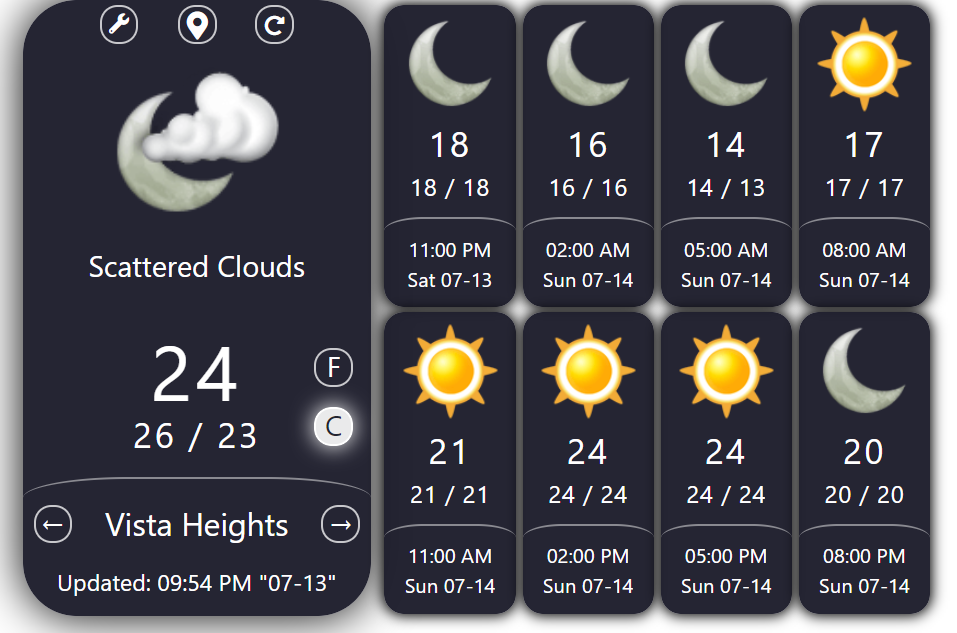

# Weather Widget using OWM-API

## Overview:
This application is a universal web weather-widget, it uses Open weather Map API to retrieve weather forecast information for any city in the world.

## Project Dependencies:
This app requires to include these CDN libraries: `jquery`, `bootstrap`, `fontawesome`, `moment`.

## Basic Usage:

* The app runs by opening the `index.html` in the web-browser, then the user can allow the application to access the user's current location to better weather information.

* The app presents the current weather icons and information with brief description  and 4-days weather forecast over 3-hour time resolution. 

* The app gives the ability to navigate through 4-day weather forecast, refresh the information, and changing the temperature units between `celsius` and `fahrenheit`.

* User can change the app settings; `API-KEY`, `city name`, or `time-zone` by clicking on the `wrench` icon that located on the top-left corner.

## Screenshot of Usage:
* Screenshot of the app:

  

* Screenshot of app setting:

  

## Try it:

This [link](https://ibsafi.github.io/Weather-Widget/) will jump you to test the application, have fun!